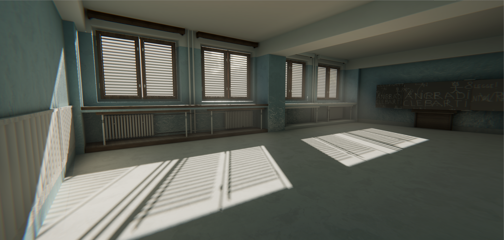

# GPU Driven Rendering Pipeline(Working in progress)

## Introduction:

GPU Driven Rendering Pipeline is a Unity Scriptable Rendering Pipeline based rendering framework and solution. Enlightened by Ubisoft's presentation in SIGGRAPH 2015, GPU Driven Pipeline will be a high-end PC/Console oriented rendering pipeline. By separate the scene into cluster with same vertex and triangle, the rendering pipeline will be easy to do frustum culling and occlusion culling by compute shader instead of classic CPU culling. Nowadays, forced by CPU's scarce computing resources, more concurrent computing work should be done in GPU instead. In cluster rendering, the whole static scene will be drawn by only one drawcall, which means CPU is fully liberated, basically the only thing CPU need to do is stream loading and unloading(LOD, Sandbox, etc.), so cluster rendering will support open world game scene natively and it will not limited by Unity's scene management.
Seeking for fully gpu driven, we also provide lots of well-optimized modern realtime rendering effects like screen space cluster based lighting & reflection. Deferred shading for opaque objects and Forward+ shading for transparent objects will provide full effects in one pass, which will mostly eliminated pixel over-draw and multi-drawcall, that will significantly increase performance.

## Features:

* GPU Driven Cluster Rendering(SIGGRAPH 2015, Ubisoft Corp)
* Hi-Z Occlusion Culling(SIGGRAPH 2015, Ubisoft Corp)
* Screen Space Cluster based Lighting
* Screen Space Cluster based IBL Reflection
* Percentage-Closer Soft Shadows (NVIDIA Corp)
* Ground Truth Ambient Occlusion
* Irradiance Volume GI
* Virtual Texture Lightmap
* Temporal Anti-Aliasing
* Forward+ transparent rendering
* Physically Based and Unified Volumetric Rendering(SIGGRAPH 2015, Dice Studio, EA Corp)
* Screen post-processing effects(Lens Distortion, Chromatic Aberration, Bloom, Tonemapping, etc.)

## Currently TODO List:

* Stochastic Screen Space Reflection(SIGGRAPH 2015, Ubisoft Corp)
* Cinematic Depth of Field(Unreal Engine 4, Epic Games Corp)
* Physically based camera arguments interface

## Developers:

* Graphics Engineer: Maxwell Geng
* Technical Artist: CG-Bull Gu
* 3D Artist: Lute Lee
